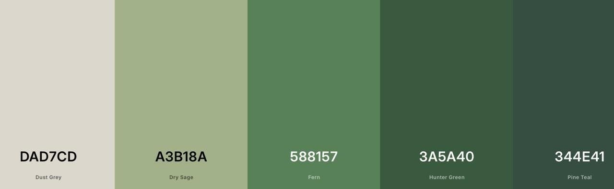

<h1 style="text-align: center">Identidade Visual</h1>

**Histórico de Revisão**

|Data|Versão|Descrição|Autor|
| - | - | - | - |
|25/08/2026|0.1|Versão inicial|Gustavo de Freitas Fidélis, Bernardo Lykawka Medeiros da Silva|

## Cores

#### Cores principais

- `#DAD7CD` — cor base clara, utilizada em fundos, áreas neutras e elementos visuais suaves.
- `#A3B18A` — cor secundária suave, aplicada em destaques sutis, cartões e elementos complementares.
- `#588157` — cor principal de destaque, usada em botões, ações primárias e elementos de navegação.
- `#3A5A40` — cor de apoio escura, utilizada em títulos, ícones e áreas de maior contraste.
- `#344E41` — cor de forte contraste, aplicada em headers, elementos institucionais e destaques de layout.

#### Cores secundárias

- `#D9EAD8` — utilizada em mensagens de sucesso com tom mais intenso para melhor legibilidade.
- `#F1E2C7` — utilizada em alertas de atenção e notificações de aviso.
- `#EACACA` — utilizada em estados de erro e feedback negativo com contraste mais adequado.
- `#D9E7F4` — utilizada em informações neutras e blocos de apoio com leitura confortável.
- `#E8E3DC` — utilizada em áreas de fundo secundário e divisões sutilmente contrastantes.
- `#FFFFFF` — utilizada em cards, campos de formulário e superfícies com maior foco visual.
- `#1F1F1F` — utilizada em textos principais e elementos de alta legibilidade.

## Tipografia

[Defina a(s) fonte(s) utilizada(s) na aplicação e os tamanhos padrão para título de página, subtítulos, botões e demais textos.]

## Outros estilos definidos

### Padrões de espaçamento

O sistema deve seguir uma escala baseada em múltiplos de 4 para manter consistência visual e facilitar a construção de layouts responsivos.

- Espaço base: `4px`
- Escala recomendada: `4, 8, 12, 16, 20, 24, 32, 40, 48, 64, 80`
- Utilização:
  - padding de componentes pequenos: `8px` ou `12px`
  - gaps em cards e formulários: `16px` ou `24px`
  - separação entre blocos de conteúdo: `32px` ou `40px`

### Border radius

Os elementos devem seguir a mesma lógica de múltiplos de 4 para bordas arredondadas:

- `4px` — chips, badges e inputs pequenos
- `8px` — botões secundários e cards compactos
- `12px` — inputs e cards de conteúdo
- `16px` — cards principais, modais e containers de destaque
- `24px` — cards grandes e banners

### Sombras

As sombras devem ser discretas e consistentes, mantendo uma escala em múltiplos de 4:

- `shadow-sm`: `0 2px 4px rgba(0, 0, 0, 0.08)`
- `shadow-md`: `0 4px 8px rgba(0, 0, 0, 0.10)`
- `shadow-lg`: `0 8px 16px rgba(0, 0, 0, 0.12)`
- `shadow-xl`: `0 12px 24px rgba(0, 0, 0, 0.14)`

A sombra deve ser aplicada prioritariamente em cards, modais, menus flutuantes e blocos de destaque, com intensidade crescente conforme a importância do componente.

## Icons
Biblioteca a ser utilizada:
[Phosphor Icons](https://phosphoricons.com/)
